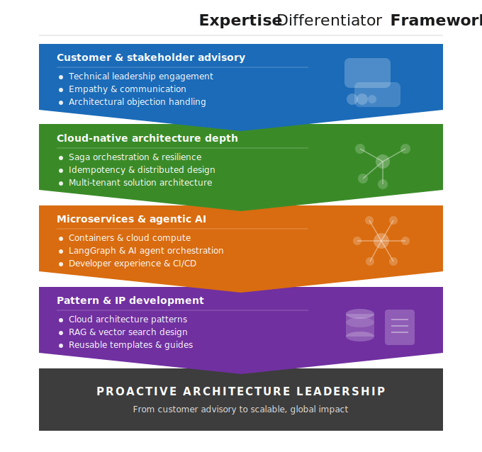

# Hi, I'm Subham Gupta 👋

**Staff Architect & AI Architect** at SAP Labs India
13+ years governing $350M+ in financial transaction volumes — now building production AI systems on AWS.

---

## What I Build

My core mental model maps 13+ years of enterprise distributed systems
patterns directly to AI-native components:

> The diagram above is not a translation — it is the same pattern set, different runtime.
> OData = FastAPI. BDEF = BaseAgent. CDS Entity = AgentState. The framework changed. The thinking didn't.

---

## Active Portfolio

### 1. Order-to-Cash Agentic AI Platform

> 5-agent LangGraph system with Amazon Bedrock RAG, hybrid OpenSearch retrieval, MCP-style tool
> microservices, Terraform IaC, and RAGAS CI/CD evaluation gate.

**Stack:** Python · FastAPI · LangGraph · Amazon Bedrock · OpenSearch · Terraform · ECS Fargate

**Key patterns:** Two-layer DynamoDB idempotency · Circuit breakers · BM25+KNN hybrid RAG ·
Policy-as-code governance · Async SQS FIFO + DLQ

**[View Repository →](https://github.com/subhamviky/order-to-cash-agentic-ai)**

---

### 2. Cloud-Native Payment Reconciliation Engine

> Production payment reconciliation engine on AWS, directly mirroring $350M SAP TM financial
> settlement architecture on cloud-native infrastructure.

**Stack:** Python · FastAPI · Lambda · SQS + DLQ · DynamoDB · CloudWatch · Amazon Bedrock

**Key patterns:** Async POST → PENDING → RECONCILED pipeline · DLQ escalation with backoff ·
LangGraph agent routing · Bedrock Titan RAG over financial audit logs

**[View Repository →](https://github.com/subhamviky/aws-reconciliation-engine)**

---
📐 **[E2A Framework](https://github.com/subhamviky/e2a-framework)** — Enterprise-to-Agentic
Architecture: formal mapping of SAP RAP / Spring Boot / Oracle patterns to LangGraph agent systems.

## What I've Proven at Enterprise Scale

At SAP Labs, working on $350M+ financial settlement systems:

- **80% runtime reduction** — Re-engineered synchronous invoicing engine to async pipeline (35 min → 7 min) for 10,000+ daily freight orders
- **Zero audit failures** — Designed idempotency + exactly-once processing for $350M+ in distributed financial postings across 150+ global vendors
- **99.9% stability** — Primary Incident Commander for 300+ mission-critical escalations annually

---

## 🏛️ Architectural Philosophy — Correct by Design
 
> *Idempotency and Reconciliation are **business features**, and not just technical safeguards.*
 
At SAP TM scale, financial integrity was achieved not by adding defensive code, but by making incorrect states architecturally impossible:
 
| SAP TM Mechanism | What It Enforces | Cloud-Native Equivalent |
|---|---|---|
| Line-Element Key | Deterministic 1:1 charge-to-settlement mapping — revised amounts route as valid updates, never duplicates | Redis `SETNX` idempotency key · DynamoDB conditional write |
| "Completely Invoiced" business gate | Ledger posting blocked until business status confirmed — immutable by contract, not by code | `SettlementState.COMPLETED` as the only valid pre-condition for ledger write |
| Dispute Management workflow | Charge delta mediation as a first-class business process — unblocks final posting without bypassing integrity | RAG-powered reasoning agent references policy docs to resolve discrepancies; CriticAgent groundedness gate |
| SAP FI posting rules | Finance Ledger is a write-once source of truth | Double-entry `UNIQUE` index on `(settlement_id, direction, entry_type)` · reversal-only corrections |
 
**The result:** every transaction is *Correct by Design* — the system governs financial integrity
at the architectural level, not at the exception-handling level.
 
This is the mental model carried from $350M+ SAP TM delivery into:
- `@Idempotent` AOP (Redis SETNX) in the Financial Settlement Platform
- Two-layer DynamoDB idempotency in the Payment Reconciliation Engine
- CriticAgent SLO gate (groundedness ≥ 0.85) in the Order-to-Cash platform

## Expertise Framework

  

## Tech Across Both Portfolios

---

## Connect

*Open to conversations about Agentic AI platform design, RAG at scale, and cloud-native financial systems.*
